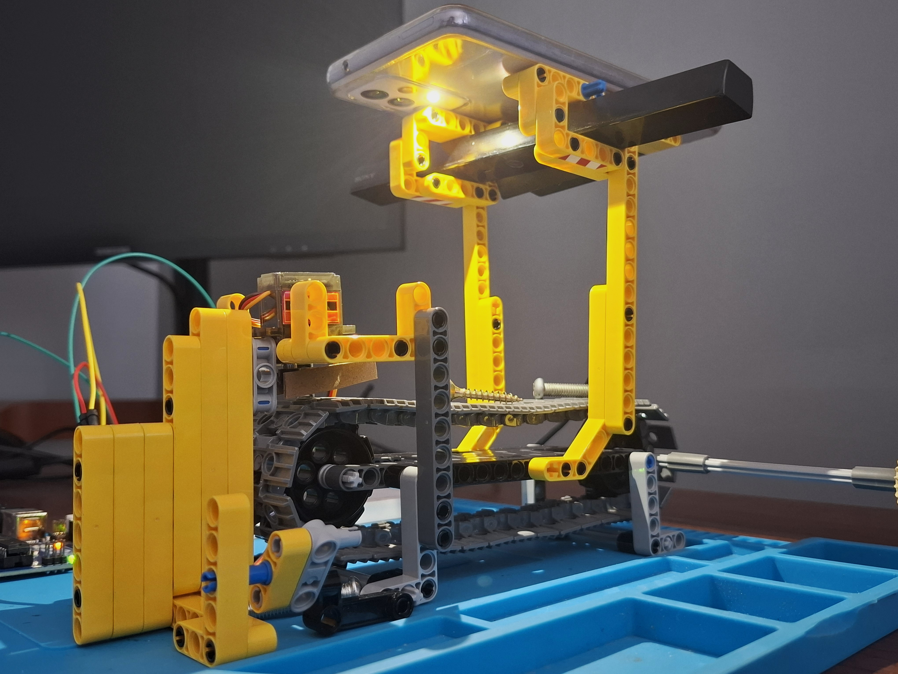
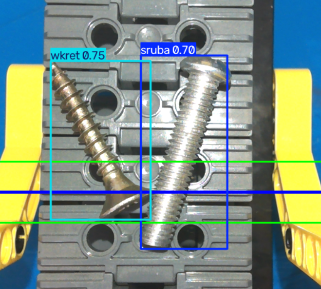

## Overview
This project simulates an automated industrial quality control and sorting line. The physical system is built with Lego Technic and features a hand-cranked conveyor belt. 

A Sony TV camera acts as the main vision sensor, while a smartphone is mounted directly above the belt to provide consistent flashlight illumination (a crucial step to stabilize the YOLO model's detection accuracy in varying room conditions). As objects move along the belt, a Python script running a custom YOLOv8 model classifies them on the fly. 

Based on the AI's classification (e.g., screw vs. wood screw), an Arduino-controlled servo motor at the end of the conveyor positions itself to physically push the item into either the left or the right sorting bin.

## System Hardware & Setup


## Video Demo
https://youtube.com/shorts/Lh5SArnXaC4?feature=share

## System Vision Preview (YOLO Detection)


## Tech Stack & Hardware
*   **Computer Vision & AI:** Python, OpenCV (`cv2`), Ultralytics YOLOv8 (Custom model for fastener classification).
*   **Hardware Control:** C++, Arduino UNO, Servo Motor.
*   **Mechanics & Environment:** Custom Lego Technic conveyor belt, Sony TV Camera, Smartphone Flashlight for consistent CV lighting.
*   **Communication:** PySerial (9600 baud rate).

## Key Engineering Features

1.  **Controlled Lighting Environment:**
    Vision AI models are highly susceptible to lighting changes. I engineered a custom mount for a smartphone flashlight directly above the detection zone to ensure consistent lumens and eliminate shadows, drastically improving the YOLO model's confidence scores.
2.  **Virtual Tripwire (Spatial Logic):**
    The sorting mechanism is only triggered when the object's center coordinates intersect a specific virtual detection zone (`WIRTUALNA_LINIA_Y +/- STREFA_DETEKCJI`), mimicking industrial photoelectric sensors.
3.  **Anti-Spam State Machine:**
    To prevent Arduino buffer overflow and erratic servo movements, I implemented a time-based lock (`OPOZNIENIE_ZAPOBIEGAJACE_SPAMOWI`). This ensures one physical object triggers exactly one binary sorting action (left or right).
4.  **Hardware Timings:**
    The Arduino code accounts for physical delays, giving the servo enough time to reach its sorting position and allowing the item to fall off the belt before returning to the neutral state.

## How to Run It

### 1. Hardware Setup
1.  Connect the sorting servo motor to `PIN 9` on the Arduino.
2.  Upload `arduino_code.ino` to the board.
3.  Ensure the Serial Monitor is closed.

### 2. Software Setup
1.  Clone this repository.
2.  Install the required dependencies:
    ```bash
    pip install opencv-python ultralytics pyserial
    ```
3.  Ensure your custom YOLO model (`best.pt`) is in the same directory as the script.
4.  Adjust the `PORT_ARDUINO` variable in `sorterAI.py` to match your system.
5.  Run the script:
    ```bash
    python sorterAI.py
    ```
